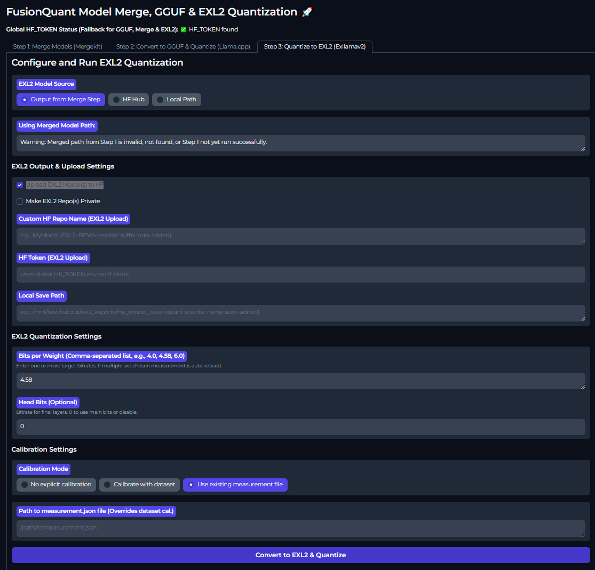

# FusionQuant 🚀

**FusionQuant Model Merge & GGUF/EXL2 Conversion Pipeline - Your Free Toolkit for Custom LLMs!**

FusionQuant empowers you to easily merge language models using Mergekit and then convert them to the efficient GGUF format (with Llama.cpp) or EXL2 format (with Exllamav2) for local execution. Whether you're experimenting with model capabilities or optimizing for deployment, FusionQuant provides a streamlined, user-friendly interface.

## Screenshots

**Step 1: Merge Models (Mergekit)**
*Configure your model merge using YAML and optionally upload to Hugging Face (public or private).*


**Step 2: Convert to GGUF & Quantize (Llama.cpp / Exllamav2)**
*Convert merged or standalone models to GGUF, with various quantization options.*


**Step 3: Convert to EXL2 & Quantize (Llama.cpp / Exllamav2)**
*Convert merged or standalone models to EXL2, with various quantization options.*



---

## Changelog

### Version 1.7

* **Bug fix**: Fixed issue with Imatrix Uploading.
* **Change**: Changed base image version, to precompile exl2 instead of using JIT compilation.
* **Security**: No longer reliant on running using Root, now correctly use Builder user.

### Version 1.7

* **Bug fix**: Fixed issue with sharded uploading.

### Version 1.6

* **Bug fix**: Fixed multiple issues with Imatrix Quants and sharding.

### Version 1.5

* **temporary bug fix**: added startup script to symlink nvidia libraries.

### Version 1.4
* **Base Docker Image Overhaul**: Changed base Docker image to use a custom precompiled `llama.cpp` and `exl2` for optimized performance and feature set.
* **Added EXL2 Quantization**: Introduced the option to quantize models to the EXL2 format using Exllamav2.
* **Local Model Saving for Merges**: Users can now save downloaded models locally for later use in merge operations, reducing redundant downloads.
* **Private Repository for Merges**: Added an option to make the Hugging Face repository private when uploading merged models.
* **Expanded GGUF Quantization Choices**: Included more quantization options for GGUF conversions.

### Version 1.3
* Added a new environment variable: APP_TEMP_ROOT if set to change the working directory for merging and quanting.
* Changed base image to llama.cpp base image (reverted to earlier build, last build is broken).
* Added CUDA support for both merging and quanting.
* Added checkbox to merge operations to choose CPU or GPU merging.
* Added Imatrix calibration file checkbox (using bartowski calibration file).

---

## Main Features

### Effortless Model Merging (Powered by Mergekit)
* **Combine Model Capabilities**: Merge base models with other fine-tuned models to create new, specialized versions.
* **Flexible YAML Configuration**: Define complex merge strategies with ease using the intuitive Mergekit YAML editor.
* **Quick Start Examples**: Jump right in with pre-defined merge examples like "Delta Linear" to get you started.
* **Hugging Face Integration**: Optionally upload your freshly merged models directly to your Hugging Face Hub repository (public or private).
* **Local Model Cache**: Save downloaded models locally to reuse in future merges without re-downloading.

### Advanced GGUF & EXL2 Conversion & Quantization
* **Optimize for Local Use**: Convert your models (merged or standalone) to the popular GGUF format (via Llama.cpp) or the high-performance EXL2 format (via Exllamav2).
* **Wide Range of Quantization Options**:
    * **GGUF (Llama.cpp)**: Choose from various standard quantization levels (e.g., Q2_K, Q3_K_S, Q3_K_M, Q3_K_L, Q4_0, Q4_K_S, Q4_K_M, Q5_0, Q5_K_S, Q5_K_M, Q6_K, Q8_0, F16, F32, and more) to balance model size, speed, and performance.
    * **EXL2 (Exllamav2)**: Utilize EXL2 quantization for efficient inference, especially on compatible hardware. Choose your desired bits per weight (e.g., 2.0, 2.4, 3.0, 4.0, 4.5, 6.0, 8.0 bpw).
        * **Note on EXL2**: When performing EXL2 quantization for the first time in a session, it might take a little longer to start. This is normal as it's loading its C++ libraries (Just-In-Time compilation).
* **Importance Matrix Support (GGUF)**: Advanced users can leverage an importance matrix for more nuanced and potentially higher-quality GGUF quantization.
* **Large Model Handling (GGUF)**: Option to split very large GGUF models into manageable shards.
* **Hugging Face Upload**: Seamlessly upload your GGUF/EXL2 models to Hugging Face, with options for public or private repositories.

---

## Key Advantages

* **Two-Step Pipeline**: A guided process takes you from merging models directly through to GGUF/EXL2 conversion.
* **Standalone Operation**: Use Step 1 (Merge) or Step 2 (GGUF/EXL2 Conversion) independently.
    * Want to just convert an existing model from Hugging Face or your local drive to GGUF/EXL2? No problem!
    * Only need to merge models? That's covered too.
* **User-Friendly Interface**: Built with Gradio for an intuitive web UI.
* **Real-time Logging**: Monitor the progress of your merge and conversion tasks with live log outputs.

---

## Requirements for Local Execution

To run FusionQuant effectively using Docker, especially with GPU acceleration and local model storage, please ensure your system meets the following requirements:

1.  **Docker Engine (Linux Recommended)**:
    * It is highly recommended to use Docker Engine for Linux. You can find installation instructions here: [https://docs.docker.com/engine/install/](https://docs.docker.com/engine/install/)
    * **Note on Docker Desktop (Linux)**: Docker Desktop for Linux does *not* currently support passing NVIDIA GPUs to containers effectively for tasks like EXL2 quantization.
    * **Note on Docker Desktop (Windows WSL2)**: While Docker Desktop for Windows with WSL2 is an option, performance can be significantly impacted (atrocious), and there are known issues with EXL2 quantization due to Windows folder permissions. Proceed with caution.

2.  **NVIDIA Container Toolkit (for GPU Acceleration)**:
    * If you plan to use NVIDIA GPUs for acceleration (essential for EXL2, highly recommended for GGUF quantization and Merging), you **must** install the NVIDIA Container Toolkit on your Linux host.
    * Installation guide: [https://docs.nvidia.com/datacenter/cloud-native/container-toolkit/latest/install-guide.html](https://docs.nvidia.com/datacenter/cloud-native/container-toolkit/latest/install-guide.html)

3.  **Resource Allocation (CPU & Memory)**:
    * It is crucial to allocate sufficient CPU cores and memory to the Docker container. If the container consumes too much memory, your Linux host might kill the instance (OOM killer).
    * Use the `--cpu` and `--memory` flags in your `docker run` command (see "How to Run" section).

4.  **Local Folder Permissions**:
    * If you are mounting local folders to store model weights or outputs (e.g., via the `-v` flag in `docker run`), ensure these folders have the correct permissions for the container to read/write. It's often necessary to grant broad permissions, for example:
        ```bash
        chmod 777 /path/to/your/local/weights_folder
        ```
    * Replace `/path/to/your/local/weights_folder` with the actual path on your host machine.

5.  **Application Temporary Root (`APP_TEMP_ROOT`)**:
    * The application uses an environment variable `APP_TEMP_ROOT` to manage temporary files and downloaded models.
    * Ensure that the `APP_TEMP_ROOT` environment variable passed to the Docker container matches the *target path* of your mounted volume *inside the container*. For example, if you mount `-v /your/host/path:/app/data`, then you should set `-e APP_TEMP_ROOT="/app/data"`. This ensures that downloaded models and intermediate files are stored on your persistent volume.

6.  **EXL2 First-Time Use Note**:
    * As mentioned in "Main Features", the first EXL2 quantization task in a session might have a slight delay during startup due to JIT compilation of its C++ components.

---

## How to Run

* You can run FusionQuant using Docker. Ensure you have met the "Requirements for Local Execution" above.

```bash
docker run \
    --gpus all \
    --cpu="<number_of_cpu_cores>" \
    --memory="<amount_of_memory>" \
    --name fusionquant \
    -v /YOUR_LOCAL_PATH_FOR_OUTPUTS:/home/user/app/outputs \
    -e APP_TEMP_ROOT="/home/user/app/outputs" \
    -e HF_TOKEN="YOUR_HUGGINGFACE_TOKEN_OPTIONAL" \
    -it \
    -p 7860:7860 \
    --platform=linux/amd64 \
    som1tokmynam/fusionquant:latest
```


* You can also run FusionQuant using Runpod https://runpod.io/console/deploy?template=d17t1a64np&ref=49zy1qyf


---

> :warning: ## Critical Warning: `APP_TEMP_ROOT` Directory Behavior
>
> **EXTREME CAUTION IS ADVISED** when specifying the directory for `APP_TEMP_ROOT`.
>
> **Everything inside the designated `APP_TEMP_ROOT` directory WILL BE PERMANENTLY DELETED before and after each job completion.**
>
> ### Example of Incorrect Usage (Data Loss Risk!):
>
> If you set `APP_TEMP_ROOT` to `/mnt/disk1`:
>
> ```bash
> APP_TEMP_ROOT=/mnt/disk1
> ```
>
> And you intend to save your job output to `/mnt/disk1/saved_model`, **your `saved_model` directory and all its contents will be DELETED** because it resides within the `APP_TEMP_ROOT` path.
>
> ### Recommended Safe Usage:
>
> To avoid accidental data loss, use a dedicated temporary subdirectory for `APP_TEMP_ROOT` and a separate directory for your persistent data.
>
> 1.  **Create a dedicated temporary directory:**
>     For example, use `/mnt/disk1/temp_job_data` for `APP_TEMP_ROOT`.
>     ```bash
>     APP_TEMP_ROOT=/mnt/disk1/temp_job_data
>     ```
> 2.  **Use a separate directory for persistent storage:**
>     For example, use `/mnt/disk1/saved_models` to save your job outputs.
>
> ### Docker Volume Mounting:
>
> If you are using Docker, ensure you mount the parent directory (or relevant individual directories) to make both locations accessible within the container. For instance, to make the entire `/mnt/disk1` accessible:
>
> ```bash
> docker run -v /mnt/disk1:/mnt/disk1 ... your_image_name ...
> ```
>
> This way, the container can access `/mnt/disk1/temp_job_data` (for `APP_TEMP_ROOT`) and `/mnt/disk1/saved_models` (for your outputs) correctly.
>
> **ALWAYS DOUBLE-CHECK YOUR `APP_TEMP_ROOT` PATH TO PREVENT UNINTENTIONAL DATA DELETION.**

---

### Explanation of Parameters:

* --gpus all: Essential for GPU acceleration. Passes all available NVIDIA GPUs to the container. Requires NVIDIA Container Toolkit.

* --cpu="<number_of_cpu_cores>": Important for stability. Specify the number of CPU cores the container can use (e.g., --cpu="8").

* --memory="<amount_of_memory>": Important for stability. Specify the maximum amount of memory the container can use (e.g., --memory="16g" for 16GB RAM). Prevents OOM kills.

* --name fusionquant: Assigns a name to your Docker container for easier management.

* -v /YOUR_LOCAL_PATH_FOR_OUTPUTS:/home/user/app/outputs: Crucial for data persistence! Mounts a directory from your host machine (/YOUR_LOCAL_PATH_FOR_OUTPUTS) to /home/user/app/outputs inside the container. This is where your merged models, GGUF/EXL2 files, and downloaded cache will be saved. Replace /YOUR_LOCAL_PATH_FOR_OUTPUTS with an actual path on your system (e.g., $(pwd)/fusionquant_data).

* -e APP_TEMP_ROOT="/home/user/app/outputs": Crucial for model caching and temporary files. Sets the application's root directory for temporary storage to the mounted volume. Ensure this path matches the target of your volume mount.

* -e HF_TOKEN="YOUR_HUGGINGFACE_TOKEN_OPTIONAL": Optionally, pass your Hugging Face token as an environment variable. Required for uploading to private Hugging Face repositories or your own namespace.

* -it: Runs the container in interactive mode with a pseudo-TTY.

* -p 7860:7860: Maps port 7860 on your host to port 7860 in the container, allowing you to access the Gradio UI.

* --platform=linux/amd64: Specifies the platform. Useful if running on machines with different architectures (e.g., ARM-based Macs, though GPU features are primarily for x86 NVIDIA).

* som1tokmynam/fusionquant:latest: The Docker image and tag to run.

### Once running, open your web browser and navigate to http://localhost:7860.

---

### Docker compose

```bash
version: '3.8'
services:
  my-app-service: # Rename to your service's name
    container_name: FusionQuant # specify a container name
    image: som1tokmynam/fusionquant:latest
    environment:
      - NVIDIA_VISIBLE_DEVICES=all # NVIDIA GPU support (Mandatory)
      - NVIDIA_DRIVER_CAPABILITIES=compute,utility
      - CUDA_VISIBLE_DEVICES=0 # if specific GPU indexing is needed, or All
      - USE_CUDA_DOCKER=true
      - HF_TOKEN=YOUR_HUGGINGFACE_TOKEN_HERE # Example: API token
      - APP_TEMP_ROOT=/app_temp # Example: In-container temp path
      - TZ=America/Toronto # optional: e.g., Your/Timezone 
    deploy:
      resources:
        limits:
          cpus: '10.0' # Adjust CPU limit
          memory: 150G # Adjust Memory limit
        reservations: # For GPU reservation with NVIDIA runtime (Mandatory)
          devices:
            - driver: nvidia
              capabilities: [gpu]
              count: all # Or specify a number, e.g., 1, if you don't want to assign all GPUs
    ports:
      - "7860:7860" # YOUR_HOST_PORT:CONTAINER_PORT e.g., "7870:7860"
    volumes:
      # Mount host paths or named volumes to container paths
      - /path/on/host/data:/data/in/container # Example: Model weights directory
      # - /another/host/path:/app/logs # Example: Temp job directory
    extra_hosts:
      - "host.docker.internal:host-gateway" # Allows container to reach the host
    networks:
      - my-app-network # Connect to the custom network defined below
    restart: unless-stopped # Or 'always', 'on-failure', 'no'

networks:
  my-app-network: # Define a custom network for your services
    driver: bridge
```

---

### To Implement / Fix

* ~~Security: Transition away from running Docker container processes as root. Implement a non-root user with appropriate permissions within the Dockerfile.~~

* Gradio Share: Add --share option to combined_app.py for easy public sharing of the Gradio interface when needed.

* Quantization Tool Evaluation: Continuously evaluate and potentially integrate other quantization tools if they offer significant advantages.

* Inference Testing: Consider adding a lightweight inference engine integration (e.g., via llama.cpp server or similar) for quick testing of generated GGUF/EXL2 models directly within the UI.

---

### Acknowledgements and Core Technologies

FusionQuant stands on the shoulders of giants. This application integrates and provides an interface for the following outstanding open-source projects:

* Mergekit: Used for all model merging functionalities.

* GitHub: https://github.com/arcee-ai/mergekit

* Llama.cpp: Used for GGUF conversion and quantization.

* GitHub: https://github.com/ggerganov/llama.cpp (Note: original repo is ggml-org, but ggerganov/llama.cpp is the active one)

* Exllamav2: Used for EXL2 quantization.

* GitHub: https://github.com/turboderp/exllamav2

* We are incredibly grateful to the developers and maintainers of these projects for their significant contributions to the open-source AI community. Please refer to their respective repositories for more detailed information, licensing, and to support their work.

### Technologies Used

* Backend: Python, Gradio

* Core Engines: Mergekit, Llama.cpp (via subprocess), Exllamav2 (via subprocess)

* Frontend: Gradio (Web UI)

* Containerization: Docker


