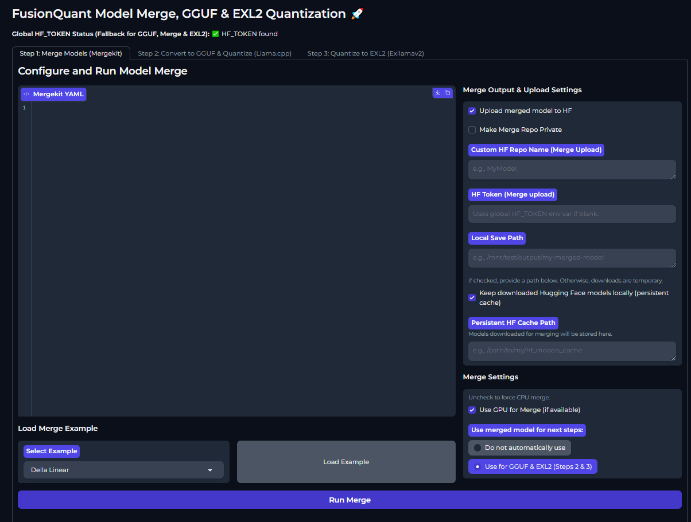

# FusionQuant 🚀

**FusionQuant Model Merge & GGUF Conversion Pipeline - Your Free Toolkit for Custom LLMs!**

FusionQuant empowers you to easily merge language models using Mergekit and then convert them to the efficient GGUF format with Llama.cpp for local execution. Whether you're experimenting with model capabilities or optimizing for deployment, FusionQuant provides a streamlined, user-friendly interface.

## Screenshots

**Step 1: Merge Models (Mergekit)**
*Configure your model merge using YAML and optionally upload to Hugging Face.*


**Step 2: Convert to GGUF & Quantize (Llama.cpp)**
*Convert merged or standalone models to GGUF, with various quantization options.*


---

## Main Features

### Effortless Model Merging (Powered by Mergekit)
* **Combine Model Capabilities**: Merge base models with other fine-tuned models to create new, specialized versions.
* **Flexible YAML Configuration**: Define complex merge strategies with ease using the intuitive Mergekit YAML editor. [cite: 1]
* **Quick Start Examples**: Jump right in with pre-defined merge examples like "Delta Linear" (Note: The screenshot shows "Example: Delta, Linear..." as a placeholder in the YAML, and the `load_merge_examples` function in `combined_app.py` loads various examples including a default linear merge [cite: 1]) to get you started.
* **Hugging Face Integration**: Optionally upload your freshly merged models directly to your Hugging Face Hub repository. [cite: 1]

### Advanced GGUF Conversion & Quantization (Powered by Llama.cpp)
* **Optimize for Local Use**: Convert your models (merged or standalone) to the popular GGUF format, perfect for running LLMs efficiently on consumer hardware with tools like Llama.cpp.
* **Wide Range of Quantization Options**: Choose from various standard quantization levels (e.g., Q2_K, Q3_K_M, Q4_K_M, Q5_K_M, Q8_0) to balance model size, speed, and performance according to your needs. [cite: 1]
* **Importance Matrix Support**: Advanced users can leverage an importance matrix for more nuanced and potentially higher-quality quantization. [cite: 1]
* **Large Model Handling**: Option to split very large GGUF models into manageable shards. [cite: 1]
* **Hugging Face Upload**: Seamlessly upload your GGUF models to Hugging Face, with options for public or private repositories. [cite: 1]

---

## Key Advantages

* **Two-Step Pipeline**: A guided process takes you from merging models directly through to GGUF conversion. [cite: 1]
* **Standalone Operation**: Use Step 1 (Merge) or Step 2 (GGUF Conversion) independently.
    * Want to just convert an existing model from Hugging Face or your local drive to GGUF? No problem! [cite: 1]
    * Only need to merge models? That's covered too. [cite: 1]
* **User-Friendly Interface**: Built with Gradio for an intuitive web UI. [cite: 1]
* **Real-time Logging**: Monitor the progress of your merge and conversion tasks with live log outputs. [cite: 1]

---

## How to Run

You can run FusionQuant using Docker:

```bash
docker run --user=root --name fusionquant -v /YOURVOLUMEPATH:/home/user/app/outputs -it -p 7860:7860 -e HF_TOKEN="YOURTOKEN(OPTIONAL)" --platform=linux/amd64 som1tokmynam/fusionquant:1.1```

## Explanation of Parameters:

--user=root: (Temporary, see "To Implement/Fix")
--name fusionquant: Assigns a name to your Docker container.
-v /YOURVOLUMEPATH:/home/user/app/outputs: Crucial! Mount a volume from your host machine (/YOURVOLUMEPATH) to /home/user/app/outputs in the container. This is where your merged models and GGUF files will be saved, ensuring they persist after the container stops. Replace /YOURVOLUMEPATH with an actual path on your system, e.g., $(pwd)/fusionquant_outputs.
-it: Runs the container in interactive mode with a TTY.
-p 7860:7860: Maps port 7860 on your host to port 7860 in the container (Gradio UI).
-e HF_TOKEN="YOURTOKEN(OPTIONAL)": Optionally, pass your Hugging Face token as an environment variable for uploads. This is recommended for uploading to private repos or your own namespace.
--platform=linux/amd64: Specifies the platform, useful for running on machines with different architectures (e.g., ARM-based Macs).
som1tokmynam/fusionquant:1.1: The Docker image to run.
Once running, open your web browser and navigate to http://localhost:7860.

---

## To Implement / Fix

Security: Transition away from running Docker container processes as root. Implement a non-root user with appropriate permissions within the Dockerfile.
Gradio Share: Add --share option to combined_app.py for easy public sharing of the Gradio interface when needed.
CUDA Support: Integrate NVIDIA CUDA support in the Dockerfile and application for GPU-accelerated merging and potential future GPU-accelerated quantization tasks.
Quantization Tool: Evaluate and potentially switch from llama.cpp's quantization tools to koboldcpp-quantize if it offers advantages.
Inference Testing: Add Kobold.cpp (or a similar lightweight inference engine) integration for quick testing of generated GGUF models directly within the UI.
Technologies Used
Backend: Python, Gradio, Mergekit, Llama.cpp (via subprocess) 

---

Acknowledgements and Core Technologies
FusionQuant stands on the shoulders of giants. This application integrates and provides an interface for the following outstanding open-source projects:

Mergekit: Used for all model merging functionalities.
GitHub: https://github.com/arcee-ai/mergekit
Llama.cpp: Used for GGUF conversion and quantization.
GitHub: https://github.com/ggml-org/llama.cpp
We are incredibly grateful to the developers and maintainers of these projects for their significant contributions to the open-source AI community. Please refer to their respective repositories for more detailed information, licensing, and to support their work.

Technologies Used
Backend: Python, Gradio
Core Engines: Mergekit, Llama.cpp (via subprocess)
Frontend: Gradio
Containerization: Docker
